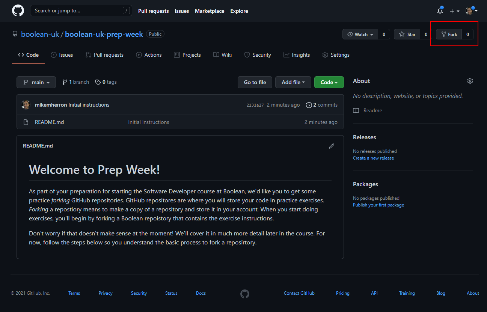
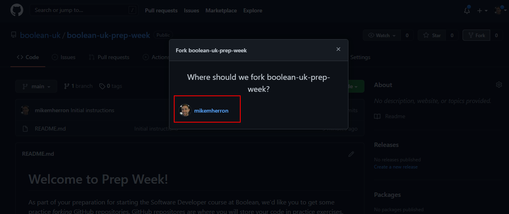
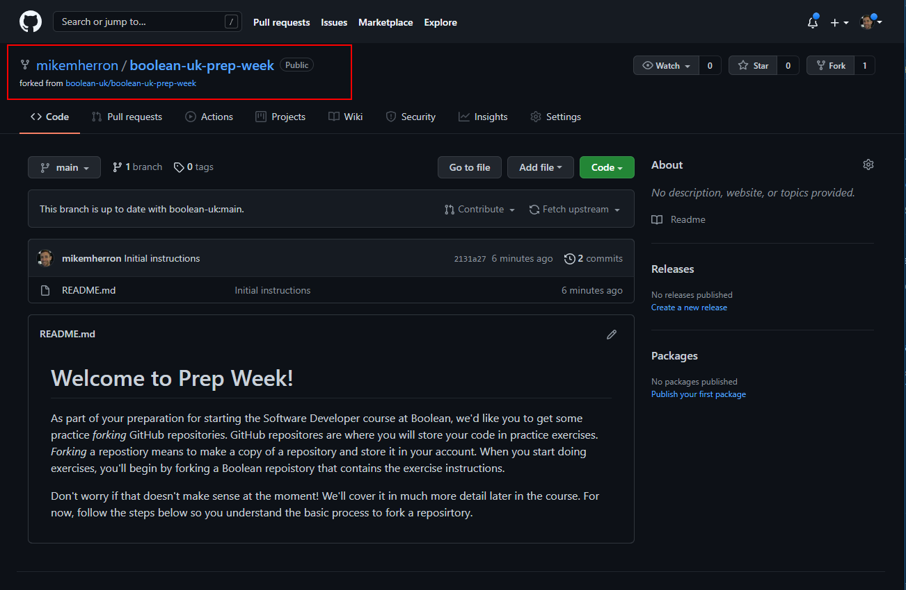

# Welcome to Prep Week!
As part of your preparation for starting the Software Developer course at Boolean, we'd like you to get some practice *forking* GitHub repositories.
 
GitHub repositories are where you will store your code in practice exercises. *Forking* a repository means to make a *copy* of a repository that is stored in your own GitHub account. When you work on exercises you'll begin by forking a Boolean repository that contains the exercise instructions.
 
 Don't worry if that doesn't make sense at the moment! We'll cover it in much more detail later in the course. For now, follow the steps below to fork this repository so you understand the basic process.
 
## How to fork a repository
Start by selecting the **Fork** button in the top right of this repository:
 

 
GitHub will then ask you where you want to store the forked repository - select your own GitHub account from the list:
 

 
GitHub will tell you the fork is in progress. Once it's complete, you will then see a copy of this repository in your own GitHub account. You can verify the location of the repository, and where it was forked from, by checking the repository path in the top left:
 

 
...and that's it! This is the process you'll go through when you work on afternoon exercises and projects. If you run into any issues creating the fork just ask for help in your `#support` channel in Discord.